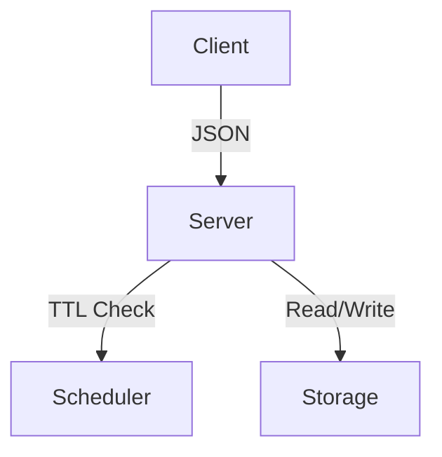

# ChronoDB ⏳⚡

**A time-aware key-value store written in Rust**  
*"Data with an expiration date"*

[](LICENSE)
[](https://github.com/blhmr/chronodb/actions)

## Table of Contents
- [Features](#features)
- [Installation](#installation)
- [Usage](#usage)
- [API Reference](#api-reference)
- [Examples](#examples)
- [Architecture](#architecture)
- [Roadmap](#roadmap)
- [Contributing](#contributing)
- [License](#license)

## Features
- 🕒 **TTL Support**: Automatic key expiration
- 🚀 **JSON-over-TCP**: Simple protocol
- 🔍 **Wildcard Queries**: `GET *` for all keys
- 📦 **Embeddable**: Single binary, no dependencies

## Installation
```sh
cargo add chronodb  # When published
# Or from source:
git clone https://github.com/yourusername/chronodb
cd chronodb && cargo build --release
```

## Usage
Start the server
```sh
chronodb --port 8080
```

Basic operations:
Set a persistent key
```json
{"method": "SET", "key": "name", "value": "ChronoDB"}
```

Set with 30s TTL
```json
{"method": "SET", "key": "temp", "value": "data", "ttl": 30}
```

Get single key
```json
{"method": "GET", "key": "name"}
```

Get all keys
```json
{"method": "GET", "key": "*"}
```

## Connection examples
Using netcat:
```sh
echo '{"method":"GET","key":"username"}' | nc localhost 8080
```

Using HTTP (if enabled)
```sh
curl -X POST -d '{"method":"SET","key":"status","value":"online"}' http://localhost:8080
```

## Notes
- All JSON commands must be newline-delimited when using raw TCP
- TTL values are in seconds (none = persistent)
- GET * returns all key-value pairs as a single JSON object

## Architecture


## License
MIT © 2025 Hatim